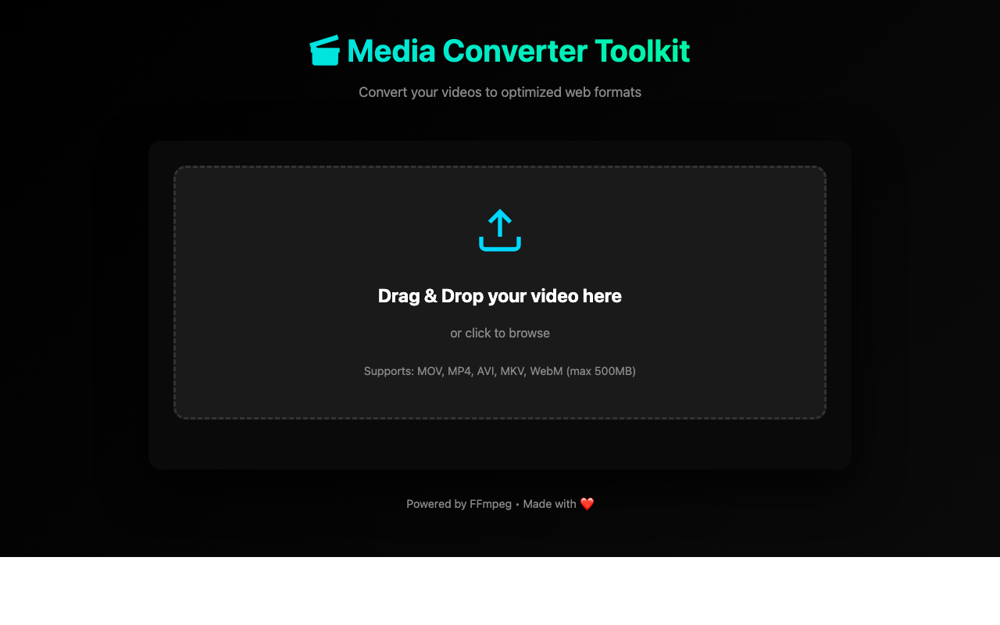

# Media Converter Toolkit

A web-based media conversion tool for converting videos to optimized formats (MP4, WebM, GIF).

**🌐 Live Demo:** [https://media-converter-toolkit.onrender.com](https://media-converter-toolkit.onrender.com)



## Quick Start

1. **Install dependencies:**
   ```bash
   npm install
   ```

2. **Install FFmpeg** (required):
   ```bash
   # macOS
   brew install ffmpeg
   
   # Linux (Ubuntu/Debian)
   sudo apt-get install ffmpeg
   
   # Windows
   # Download from https://ffmpeg.org/download.html
   ```

3. **Start the server:**
   ```bash
   npm start
   ```

4. **Open your browser:**
   ```
   http://localhost:3000
   ```

## Features

- Convert videos to MP4, WebM, or animated GIF
- Optimize quality, resolution, and frame rate
- Preserve original filenames
- Preview converted files before downloading
- Quick presets for GitHub README and web optimization

## Future Features

- ✂️ **Clip Editing/Cropping**: Extract specific segments from videos to create GIFs
- 🔗 **Media Combining**: Merge multiple videos or images into a single file
- 🎨 **Advanced Filters**: Apply effects and filters during conversion
- 📊 **Batch Processing**: Convert multiple files at once

## Project Structure

```
├── server.js          # Express server with conversion logic
├── package.json       # Dependencies
├── Dockerfile         # Docker configuration for deployment
├── render.yaml        # Render.com deployment configuration
├── public/            # Frontend files
│   ├── index.html     # Main interface
│   ├── app.js         # Client-side JavaScript
│   └── styles.css     # Styling
├── uploads/           # Temporary upload storage (gitignored)
└── outputs/           # Converted files (gitignored)
```

## Scripts

- `npm start` - Start the server
- `npm run dev` - Start with auto-reload (requires nodemon)

## Requirements

- Node.js
- FFmpeg installed on your system
- npm or yarn

## Deployment

This app is configured for deployment on Render.com using Docker. The `render.yaml` and `Dockerfile` handle automatic FFmpeg installation and deployment.

## License

MIT
